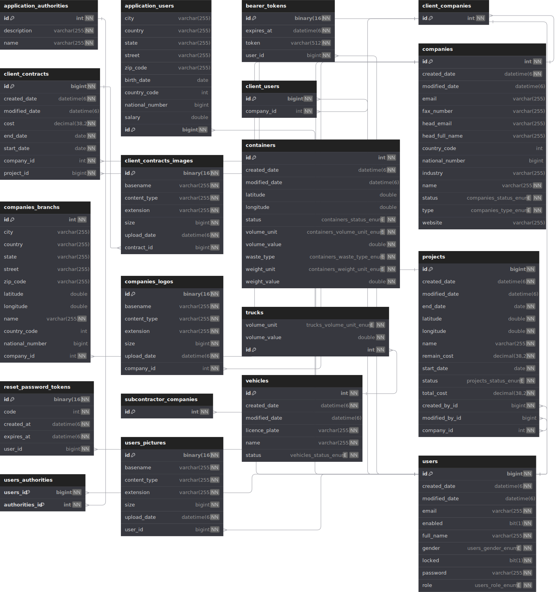
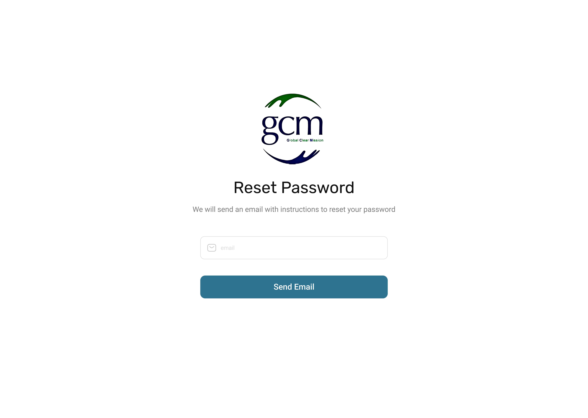
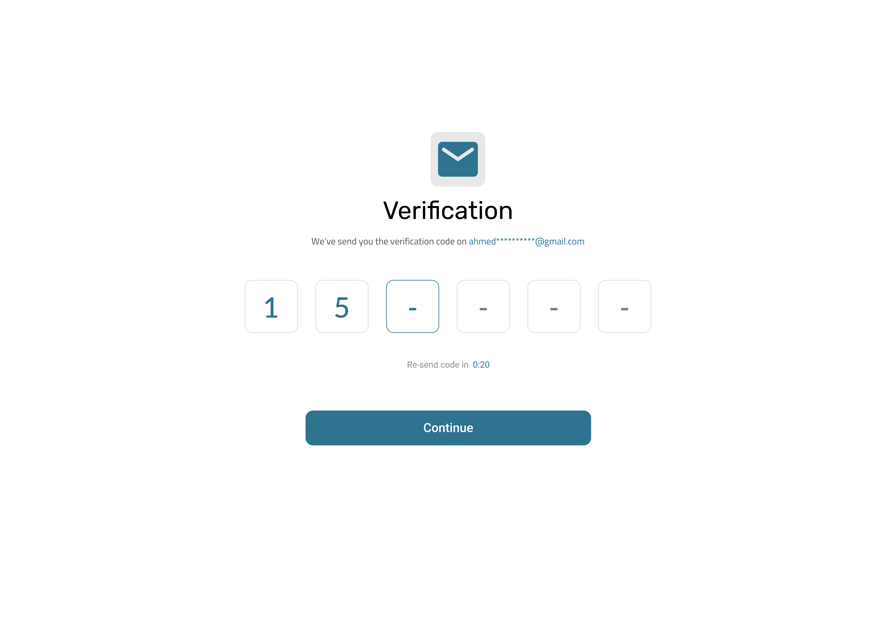
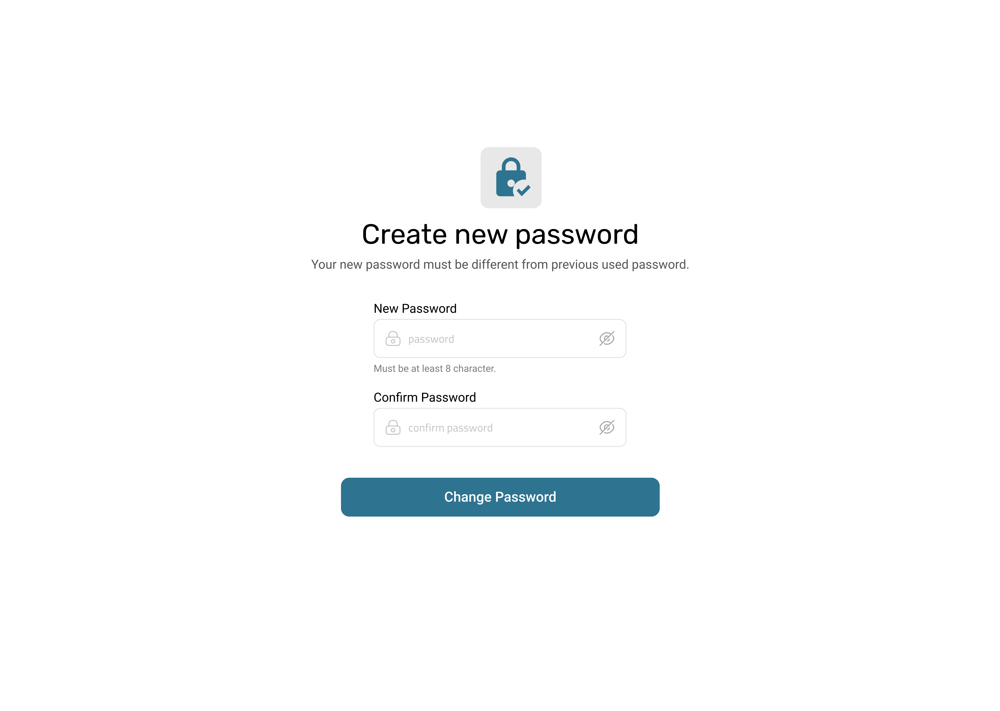
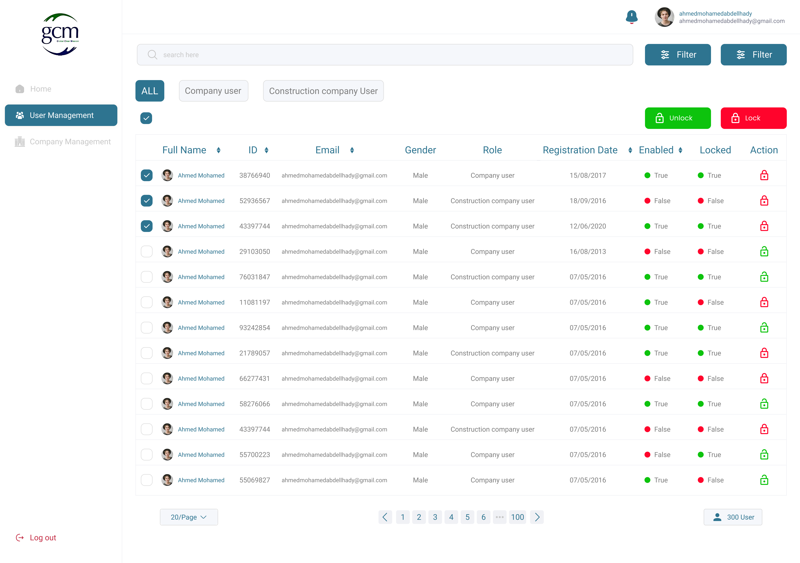

# Freelance Experience

Welcome to my Freelance Experience repository! This repository provides a comprehensive overview of the professional work and freelance projects I have developed over the years. Each project includes detailed descriptions, technical specifications, and relevant resources to help you explore my work.

## Table of Contents

- [Project 4: **GCM Project**](#gcm)
- [Project 4: **Gazl**](#gazl)
- [Project 2: **Arrafni**](#arrafni)
- [Project 1: **Mulham**](#mulham)
- [Contact](#contact)

---

## GCM

### Description

A platform built for "Global Clear Mission", a construction waste management company in Saudi Arabia It centralizes the management of resources, services, orders, clients, and documents, streamlining operations for their waste recycling services in the construction sector.

### Duration

- **Start Date:** August 2024
- **End Date:** Current working on

### Database Schema



[Schema SQL File](gcm/schema.sql)

### Screenshots

<div style="display: flex; flex-wrap: wrap; gap: 10px;">
    
    
    
    
    
</div>

### Tools, Technologies, and Architecture

- **Tools:** Intellij Ultimate Edition, Docker, Git, dbdiagram.io
- **Technologies:** Java 17, Spring Boot, Spring Security, Spring Data JPA
- **System Architecture:** RESTful API

### Requirements/Features

- Feature 1: Description

### External Links

- [Backend Docker Image](https://hub.docker.com/r/ahmedukamel/gcm_project)
- [Frontend Docker Image](https://hub.docker.com/r/abdulrahmanmahmoud/gcm_project)
- [API Documentation](https://documenter.getpostman.com/view/26297954/2sA3s6EVCo)
- [UI / UX Design Figma](https://www.figma.com/design/2eNzsuKLqtlswRorfBELDS/GCM-Project?node-id=2021-11418&node-type=frame)

### Related Repositories

- [Frontend Repository](https://github.com/username/frontend-repo)

### Installation and Usage Guide

#### Prerequisites

- Docker installed

#### Installation Steps

1. **Create the docker compose file:**

   ```bash
   version: "3.8"

   services:
   backend:
      image: ahmedukamel/gcm_project:latest
      container_name: gcm_application_backend_container
      ports:
         - "8090:8080"
      environment:
         - SPRING_DATASOURCE_URL=jdbc:mysql://database:3306/gcm_db
         - SPRING_DATASOURCE_USERNAME=root
         - SPRING_DATASOURCE_PASSWORD=SomeStrongPass#123
      networks:
         - gcm_application_network
      volumes:
         - ./files/:/app/files
      depends_on:
         database:
         condition: service_healthy

   frontend:
      image: abdulrahmanmahmoud/gcm_project:latest
      container_name: gcm_application_frontend_container
      ports:
         - "3010:3000"
      environment:
         - NEXT_PUBLIC_BACKEND_BASE_URL=http://backend:8080
      networks:
         - gcm_application_network
      depends_on:
         - backend

   database:
      image: mysql:latest
      container_name: gcm_application_database_container
      ports:
         - "3316:3306"
      environment:
         - MYSQL_DATABASE=gcm_db
         - MYSQL_ROOT_PASSWORD=SomeStrongPass#123
      networks:
         - gcm_application_network
      volumes:
         - ./database/:/var/lib/mysql
      healthcheck:
         test: ["CMD", "mysqladmin", "ping", "-h", "localhost"]
         retries: 10
         interval: 3s
         timeout: 30s

   networks:
   gcm_application_network:
      name: gcm_application_network
   ```

2. **Start the Frontend and Backend:**

**Linux:**

```bash
docker compose up -d
```

**Windows:**

```bash
docker-compose up -d
```

3. **Access the Application:**
   - Website: `http://localhost:3010`
   - Backend API: `http://localhost:8090`
   - Database: `http://localhost:3316`

---

## Contact

Feel free to connect with me on [LinkedIn](https://www.linkedin.com/in/ahmedukamel/) or check out my [GitHub](https://github.com/ahmedukamel) profile for more of my work.
